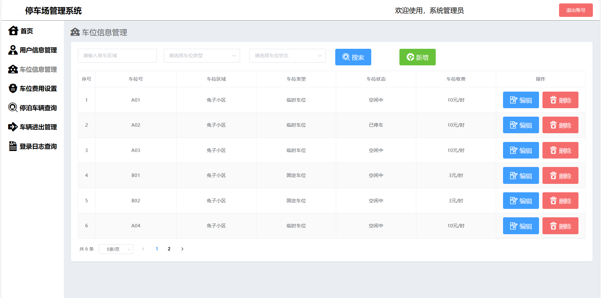
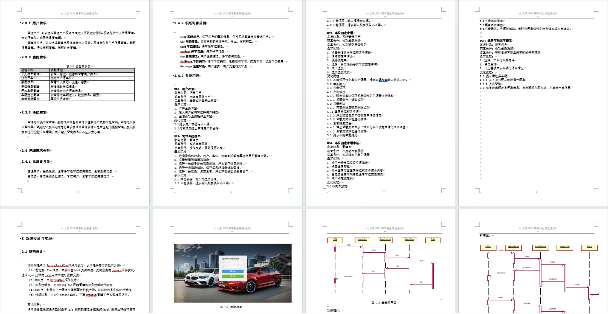

# 基于springboot+vue前后端分离的停车场管理系统

### 9.9￥ 获取完整源码+sql，附赠10000字论文参考，需要的加Q：3808981644 备用Q：3577148218
### 有问题，或者需要协助调试运行项目的也可联系
### 获取更多项目，关注公众号：编程项目集

## 一、介绍

运行环境:idea或eclipse vscode 数据库:mysql

开发语言：java

前端技术：vue、element-ui

后端技术：springboot、mybatisplus

系统有两个角色：管理员和用户

一、 管理员

用户信息管理

车位信息管理

车位费用设置

停泊车辆管理

车辆进出管理

登录日志查询

二、车主

个人中心

预定停车位

缴费信息（停车缴费记录、待缴费、账户余额充值）

## 二、部分页面截图展示

## 三、10000字论文参考

### 9.9￥ 获取完整源码+sql，附赠10000字论文参考，需要的加Q：3808981644 备用Q：3577148218
### 有问题，或者需要协助调试运行项目的也可联系

